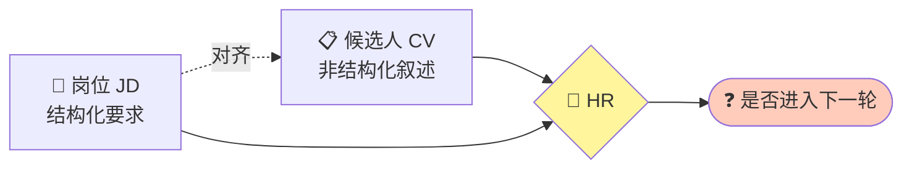
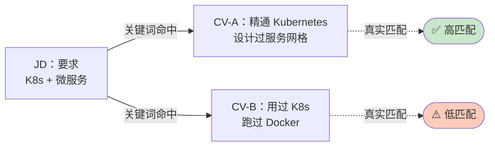
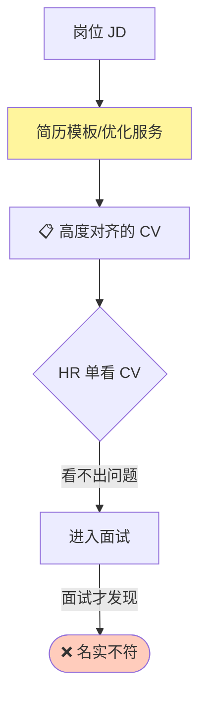
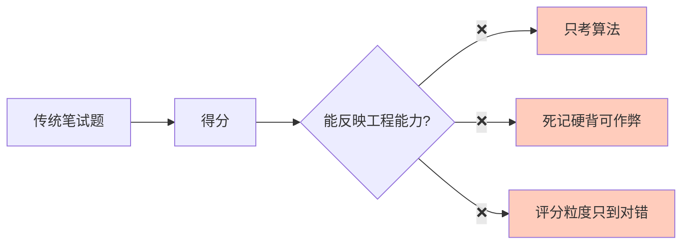
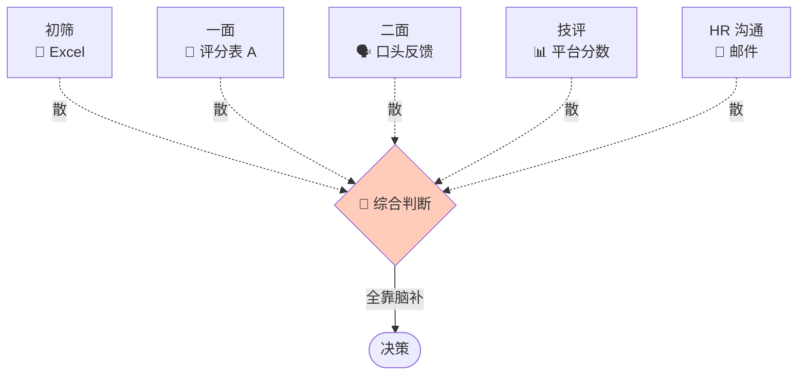
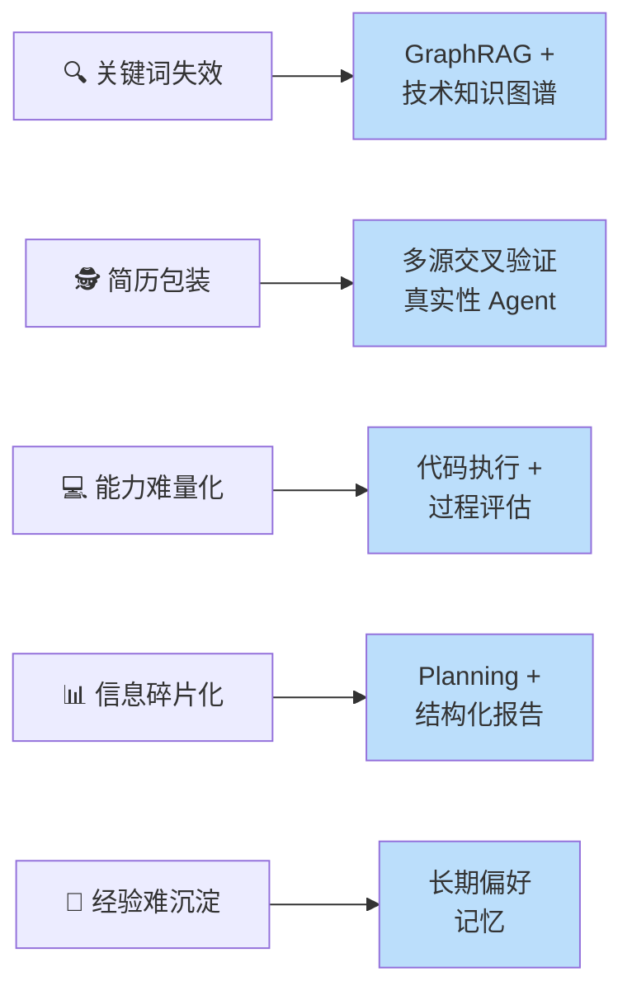
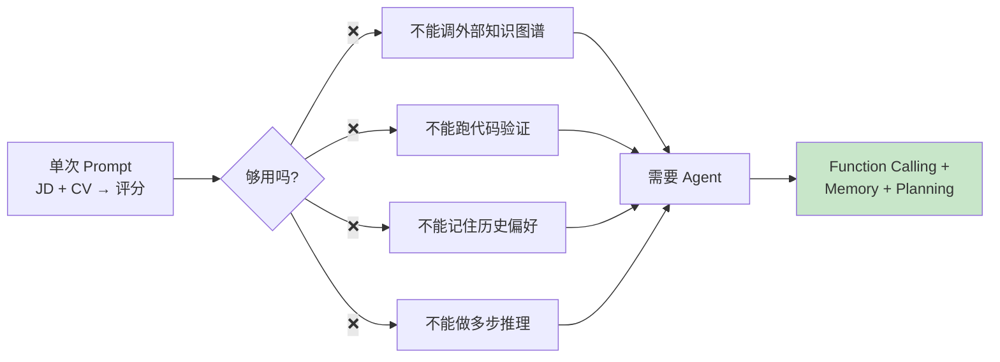
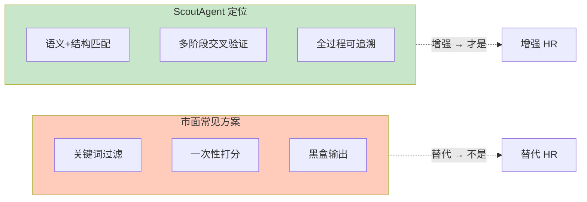
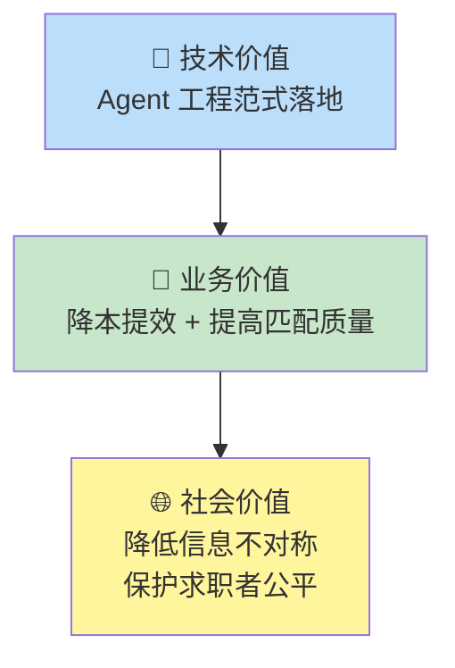
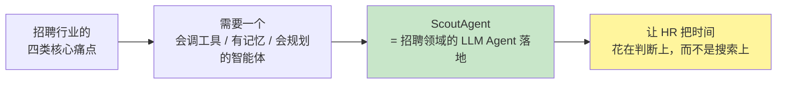

# ScoutAgent 选题背景 · PPT 速览版

> **从招聘行业的真实痛点，到 Agent 技术方案的反向推演**
> 每页一个核心矛盾 + 一句话结论

---

## 开场：为什么是"招聘 + Agent"

招聘是一个**信息密度极高、判断成本极重、容错率极低**的场景：



> **一句话**：HR 每天都在用"人脑"做"大模型该做的活"——在海量异构文本里找匹配、辨真伪、做综合判断。
> 这正是 LLM Agent 最该被使用的场景。

---

# 一、行业痛点全景

## 1.1 招聘流程里的"四座大山"

```mermaid
flowchart TB
    Pool[📥 简历池<br/>每岗位 100~1000 份] --> P1[🔍 痛点 1<br/>JD-CV 匹配低效]
    P1 --> P2[🕵️ 痛点 2<br/>简历真实性存疑]
    P2 --> P3[💻 痛点 3<br/>技术能力难量化]
    P3 --> P4[📊 痛点 4<br/>综合评估靠"感觉"]
    P4 --> Out([最终录用决策])

    style P1 fill:#ffcdd2
    style P2 fill:#ffcdd2
    style P3 fill:#ffcdd2
    style P4 fill:#ffcdd2
```

| 阶段 | HR 实际做的事 | 主要痛点 |
|---|---|---|
| 初筛 | 关键词搜简历 | 同义词/技术栈迁移识别不到 |
| 深筛 | 看项目经历 | 包装、虚标、年限注水难辨 |
| 技评 | 出题、看代码 | 题目同质化、判分主观 |
| 终评 | 拍板、写理由 | 多轮信息散落、难复盘 |

---

## 1.2 痛点一：关键词匹配 ≠ 能力匹配

**HR 现状**：用 ATS 系统按关键词过滤，结果"会写 Golang 的"和"5 年 Go 后端经验"被同等对待。



**根因**：
- 技术栈有**同义词**（K8s ≡ Kubernetes）
- 技术栈有**上下位关系**（Spring Cloud ⊂ 微服务）
- 技术栈有**迁移能力**（会 Java 后端 → 大概率能上手 Go 后端）

> 纯文本匹配天然处理不了"语义 + 结构"的双重对齐。

---

## 1.3 痛点二：简历"通用化包装"已成产业

**现状**：市面充斥"简历优化教程"，候选人会针对 JD 反向定制简历。



**典型包装手法**：
- **职责膨胀**：把团队成果写成个人主导
- **技术堆砌**：列一堆框架但说不清深度
- **时间含糊**：用"参与/负责/主导"模糊真实贡献
- **项目挪用**：拿开源项目当自研经历

> 单点信息无法证伪，必须**跨字段交叉验证**才能识破。

---

## 1.4 痛点三：技术能力评估靠"题海 + 直觉"

**现状**：刷题站答题、白板题、八股文——离真实工程能力越来越远。



**HR 真正想知道的是**：
- 候选人**怎么思考**（解题路径）
- 代码**结构和规范**（不只是 AC）
- **被追问后的反应**（真懂还是背的）

> 现有平台只给"通过率"，给不了"过程评估"。

---

## 1.5 痛点四：多轮评估信息"碎片化"

**现状**：初筛 Excel、面试官口头反馈、技术评分表、HR 邮件——决策时拼不起来。



**带来的代价**：
- 复盘困难，**为什么淘汰**说不清
- 经验**留不下**，HR 离职即失忆
- 同公司**不同岗位**的偏好无法沉淀

> 招聘是一个长链路决策过程，需要**结构化、可追溯、可复用**的信息载体。

---

# 二、从痛点到选题：反向推演

## 2.1 痛点 ↔ 技术映射



| 行业痛点 | 选型方案 | 解决思路 |
|---|---|---|
| 同义词 / 上下位概念 | **Neo4j 知识图谱 + GraphRAG** | 把"技术栈"建成图，用结构推理代替字符串匹配 |
| 包装和虚标 | **真实性检测 Agent** | 让 LLM 跨"JD / CV / 项目 / 测试"四源比对 |
| 能力评估粗糙 | **代码执行工具 + 追问能力** | Agent 调工具拿运行结果，结合解题过程评分 |
| 决策碎片化 | **Plan-and-Execute + 报告生成** | 拆解评估流程，最终输出结构化 Markdown |
| 经验流失 | **企业级 / 岗位级偏好库** | LLM 自动识别硬性要求并 upsert 到 PG |

---

## 2.2 为什么必须是"Agent"，而不是单次 LLM 调用



**招聘任务的特征决定了它必须是 Agent**：
- 需要**外部能力**（图谱、代码沙箱、第三方系统）→ Function Calling
- 需要**跨会话记忆**（这家客户的偏好、这个岗位的硬性要求）→ Memory
- 需要**多步骤拆解**（先匹配 → 再验真 → 再技评 → 再综合）→ Planning

> 单次问答只能解决"问题"，Agent 才能解决"流程"。

---

## 2.3 选题立意：不做"AI 简历筛选器"，做"AI HR 助手"



| 维度 | 传统筛选工具 | ScoutAgent |
|---|---|---|
| **目标** | 提升处理速度 | 提升判断质量 |
| **输出** | 一个分数 | 一份带证据链的报告 |
| **对 HR** | 被取代焦虑 | 协作式增强 |
| **可解释** | 黑盒 | 计划 + 工具调用全程可见 |
| **可沉淀** | 无 | 偏好持续学习 |

---

# 三、选题价值

## 3.1 三层价值闭环



| 层面 | 价值点 |
|---|---|
| **技术** | 在真实业务里同时验证 Function Calling / Memory / Planning 三大模块的协同 |
| **业务** | HR 每岗位评估时间从"几小时/份"压缩到"几分钟/份"，且产出结构化报告 |
| **社会** | 减少"靠包装上岗"，让真实能力被看见；减少"靠学历过滤"，给非典型背景候选人机会 |

---

## 3.2 一句话收束



> **选题意图一句话**：
> 用 Agent 把招聘流程里"最重复、最易错、最难沉淀"的部分自动化，让 HR 回到"做决策"的位置。
