# ScoutAgent 后端 Agent 架构报告

> 面向 PPT 的精简版技术报告，覆盖 **Function Calling / Memory / Planning** 三大模块。

---

## 总览

ScoutAgent 后端 Agent 基于 **LangGraph** 构建，对外暴露两套图：用于实时招聘对话的 **Chat Graph (ReAct)**，以及用于复杂任务编排的 **Planning Graph (Plan-and-Execute)**。两套图共用同一套 *工具解析层 + 记忆层*。

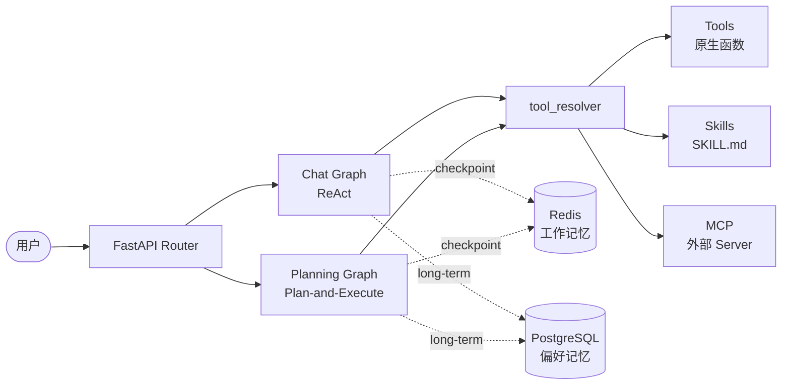

---

## 一、Function Calling：三层工具体系

ScoutAgent 把"可被 LLM 调用的能力"分成三层，由统一的 `tool_resolver.resolve_tools(config)` 在每次推理前组装。

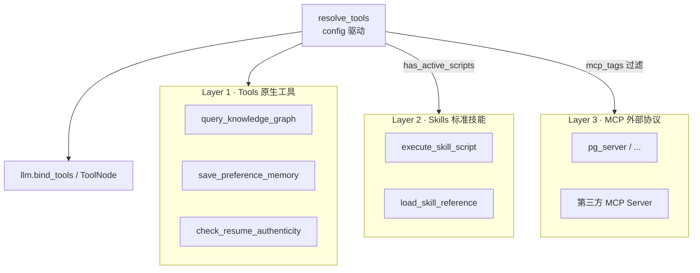

### 1.1 三类工具的对比

| 维度 | Tools | Skills | MCP |
| --- | --- | --- | --- |
| **定位** | 业务原子能力 | 领域专家手册 + 可选脚本 | 外部进程能力 |
| **载体** | Python 函数 (`StructuredTool`) | `SKILL.md` 目录 | 独立进程（stdio / http / sse）|
| **注册方式** | 模块导入 (`BASE_TOOLS = [...]`) | YAML frontmatter | `mcp_servers.json` (Pydantic 校验) |
| **发现时机** | 启动时静态导入 | 启动时扫描 `skills_installed/` | 启动时连接并 `get_tools()` |
| **典型例子** | KG 查询、保存偏好、简历真实性检测 | jd-cv-match、authenticity-check | Postgres Server |

### 1.2 Tools — 原生工具

注册路径在 `backend/app/agent/tool_resolver.py`：

```19:19:backend/app/agent/tool_resolver.py
BASE_TOOLS = [query_knowledge_graph, save_preference_memory, check_resume_authenticity]
```

每个 Tool 都是一个 `StructuredTool`，靠 Pydantic Schema 描述参数。LLM 只看到 `name + description + args_schema`，看不到实现。

### 1.3 Skills — 渐进披露式 (Progressive Disclosure)

Skills 是一种**约定大于配置**的能力包，每个 Skill 是一个目录：

```
skill-id/
├── SKILL.md          # YAML frontmatter + 主体指令
├── references/*.md   # 大块参考文档（按需加载）
└── scripts/*.py      # 可执行脚本（按需调用）
```

注册流程由 `SkillRegistry.discover(dir)` 完成，解析 `SKILL.md` 的 YAML frontmatter：

```62:72:backend/app/agent/skills/registry.py
return SkillEntry(
    id=skill_dir.name,
    name=meta["name"],
    description=meta["description"],
    path=skill_dir,
    body=body.strip(),
    has_scripts=bool(script_files),
    has_references=bool(reference_files),
    script_files=script_files,
    reference_files=reference_files,
)
```

#### 渐进披露的三档加载

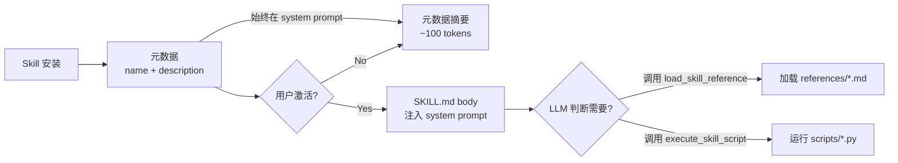

- **常驻**：所有 Skill 的 `name + description`（让 LLM 知道有什么能力）
- **激活后注入**：`active_skills` 中的 Skill 的 `SKILL.md` 主体（详细指令）
- **按需加载**：`references/` 走 `load_skill_reference` 工具，`scripts/` 走 `execute_skill_script` 工具

这种设计让 system prompt 始终保持紧凑，只在确实需要时才"展开"详细文档。

### 1.4 MCP — 外部协议层

MCP (Model Context Protocol) 把"工具"做成独立进程，用统一协议通信。注册靠 `mcp_servers.json`：

```json
{
  "version": 1,
  "servers": {
    "pg": {
      "transport": "stdio",
      "command": "python",
      "args": ["app/agent/mcp/mcp_installed/pg_server.py"],
      "tags": ["database", "read-only"]
    }
  }
}
```

发现与连接：

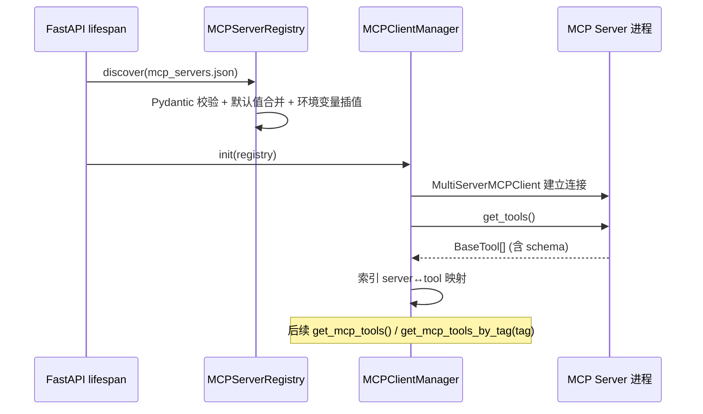

### 1.5 统一解析：`resolve_tools()`

每次 LLM 调用前，根据 `config.configurable` 动态组装工具列表：

```27:48:backend/app/agent/tool_resolver.py
def resolve_tools(config: RunnableConfig) -> list:
    active_ids = resolve_active_skills(config)
    registry = get_skill_registry()

    tools = list(BASE_TOOLS)
    if registry.has_active_scripts(active_ids):
        tools.append(execute_skill_script)
    if registry.has_active_references(active_ids):
        tools.append(load_skill_reference)

    mcp_tags = (config.get("configurable") or {}).get("mcp_tags", None)
    if mcp_tags:
        for tag in mcp_tags:
            tools.extend(get_mcp_tools_by_tag(tag))
    else:
        tools.extend(get_mcp_tools())

    return tools
```

这意味着：**同一张图，不同 session 可激活不同 Skills、不同 MCP 标签，做到"按需绑定"**。

---

## 二、Memory 体系

ScoutAgent 把记忆分成两层：**短时工作记忆**（解决"这次对话"）+ **长期偏好沉淀**（解决"这个客户的画像"）。

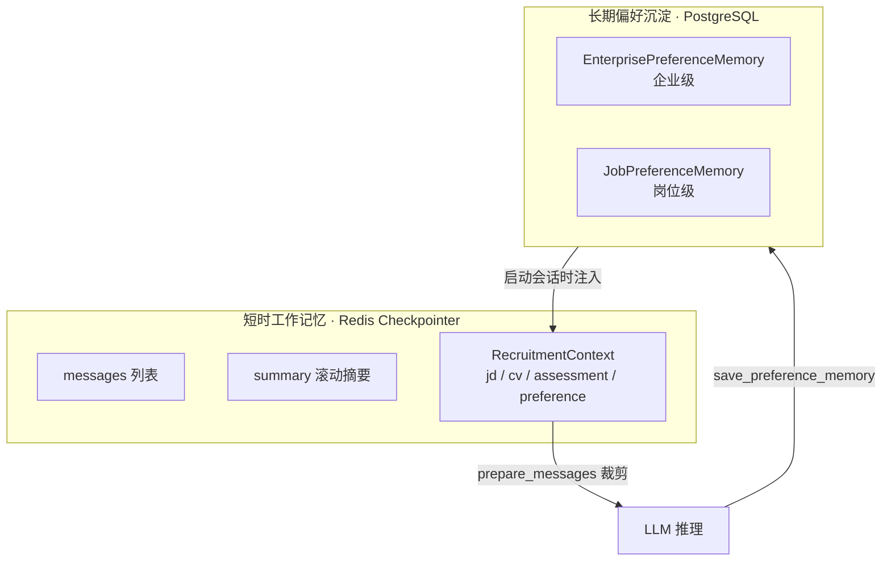

### 2.1 工作记忆与上下文管理

#### 状态结构

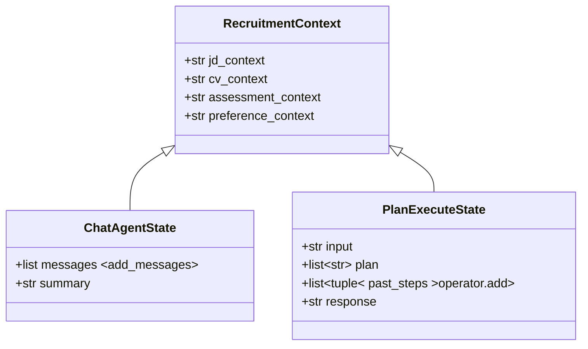

每次图执行结束，LangGraph 会把整个 state 写到 **Redis Checkpointer**（带 TTL），下次同 `thread_id` 进入时自动恢复。

#### 上下文窗口预算

`prepare_messages` 在每次 LLM 调用前做**优先级裁剪**，确保不超 `context_window_budget`：

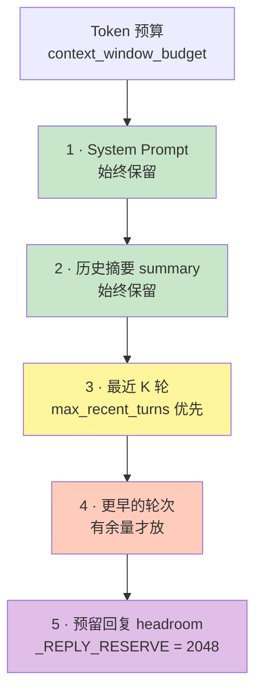

#### 滚动摘要触发

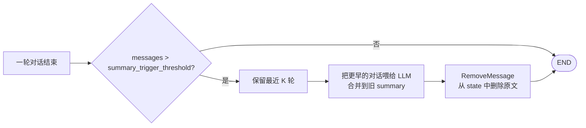

`maybe_summarize` 节点会把"更早的对话"压缩进 `summary` 字段，原始 message 通过 `RemoveMessage` reducer 从 state 删除——既保留了语义信息，又彻底回收 token。

### 2.2 长期偏好沉淀

#### 数据模型

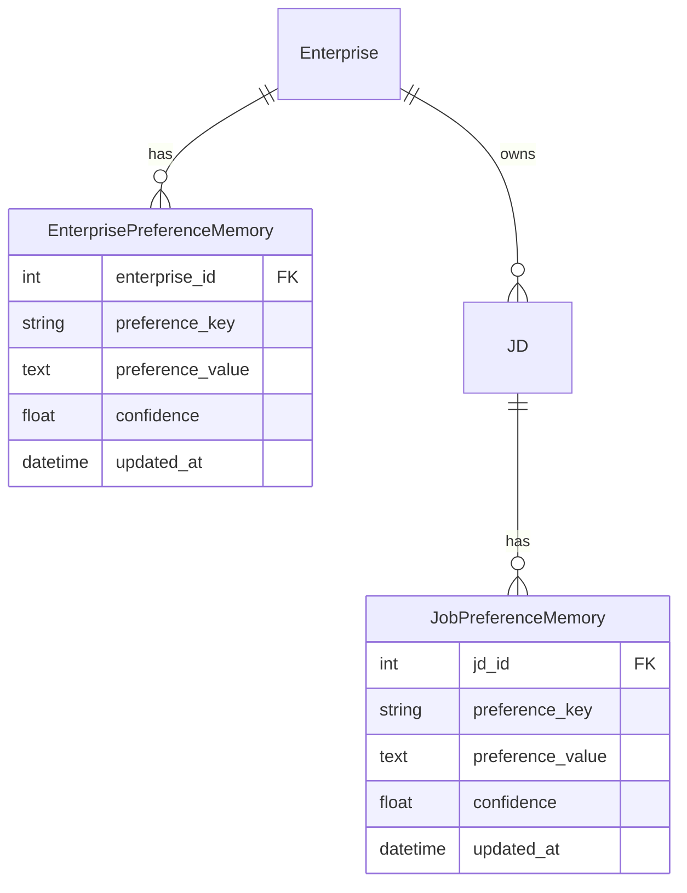

两级 scope：**企业级**（跨岗位通用，如"必须 985 学历"）和 **岗位级**（特定 JD，如"该岗位必须懂 Go"）。两者都有 `(target_id, preference_key)` 唯一约束，**写入用 upsert**（PostgreSQL `ON CONFLICT DO UPDATE`），保证同一偏好键覆盖更新。

#### 写入路径：LLM 主动调用工具

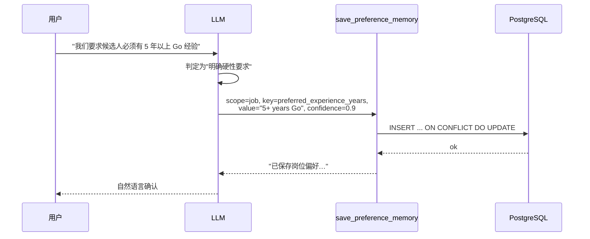

工具描述特意做了行为约束：**只在用户表达确定性硬性要求时调用，对试探性表达不调用**——把"什么是值得沉淀的偏好"的判断权交给 LLM。

#### 读取路径：会话启动时注入

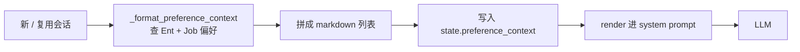

每次进入会话都会从数据库重新加载，保证最新；放在 system prompt 而非 message 里，避免被摘要节点误压缩。

---

## 三、Planning 模块

ScoutAgent 同时实现了两种主流的 Agent 范式，分别承担不同任务：

| 范式 | 适用场景 | 入口 |
| --- | --- | --- |
| **ReAct** | 实时对话、单点提问、低延时 | Chat Graph |
| **Plan-and-Execute** | 多步骤分析、报告生成、需要稳定推理链 | Planning Graph |

### 3.1 ReAct (Chat Graph)

经典的 *Reason → Act → Observe* 循环。LangGraph 用 `tools_condition` 判断 LLM 输出里是否带 tool call 来决定走向。

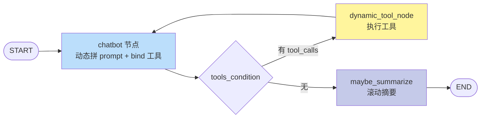

**关键点**：
- 每次进 `chatbot` 都重新 `resolve_tools(config)` 并 `bind_tools` —— 实现"运行时绑定"。
- `dynamic_tool_node` 同样动态构造 `ToolNode(tools)`，与 chatbot 共用同一份工具列表。
- 失败时通过 `ainvoke_with_fallback` 自动切换备用模型。

### 3.2 Plan-and-Execute (Planning Graph)

把任务拆成 *先规划 → 逐步执行 → 再规划* 三个阶段，每一步执行内部又是一个小型 ReAct。

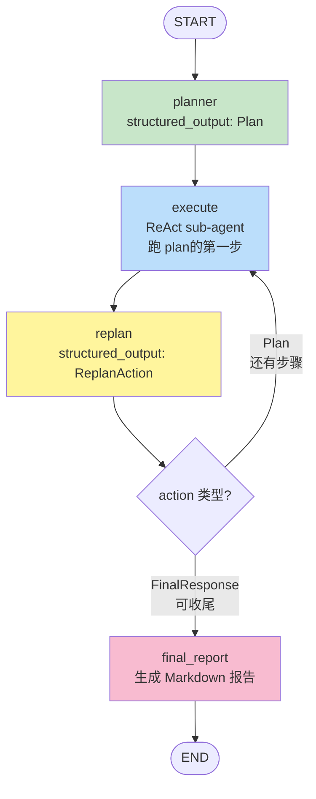

#### 三个核心节点

| 节点 | 输入 | 输出 (Pydantic) | 作用 |
| --- | --- | --- | --- |
| `plan_step` | user input + 上下文 | `Plan{steps: list[str]}` | 一次性产出有序计划 |
| `execute_step` | 当前 plan 第一项 | `past_steps += [(step, result)]` | 用 `create_react_agent` 跑一个完整子循环 |
| `replan_step` | 已执行步骤 + 剩余计划 | `ReplanAction(FinalResponse \| Plan)` | 决定继续还是收尾 |
| `final_report` | 全部 past_steps | 整合好的 Markdown | 输出最终报告 |

#### 关键设计

- **结构化输出**：`Plan / ReplanAction / FinalResponse` 都是 Pydantic 模型，用 `with_structured_output()` 强约束 LLM。
- **执行器是子图**：`execute_step` 内部用 `create_react_agent(llm, tools, prompt)` 临时构造一个 ReAct 子图跑当前步骤，遵守 `MAX_EXECUTOR_ITERATIONS = 15` 防止递归爆炸。
- **append-only state**：`past_steps` 用 `Annotated[list, operator.add]`，每个节点只追加自己的结果，避免并发写冲突。
- **可中断恢复**：与 Chat Graph 共享同一个 Redis Checkpointer，长任务可跨进程恢复。

### 3.3 ReAct vs Plan-and-Execute

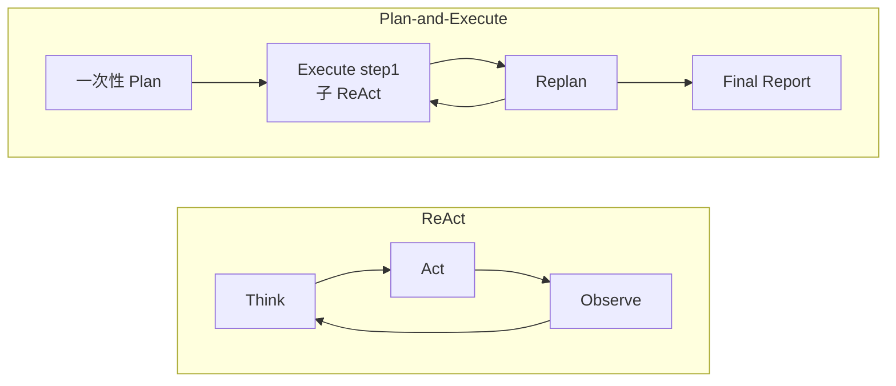

| 对比项 | ReAct | Plan-and-Execute |
| --- | --- | --- |
| 规划粒度 | 隐式、每步都重新决定 | 显式、提前一次性产出 |
| 上下文消耗 | 每步把全部历史塞进去 | 计划字符串很短，子执行器隔离 |
| 适用任务 | 短交互、单跳工具调用 | 多步分析、跨工具协作、生成报告 |
| 可解释性 | 隐藏在 message 流里 | `plan` 数组对外可见 |
| 风险 | 长链路时容易绕圈 | 计划过度刚性，需 replan 弥补 |

---

## 附：启动顺序

为方便理解整体生命周期，附 `main.py:lifespan` 启动序：

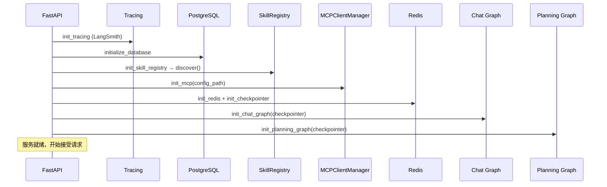

**所有"工具/技能/MCP"必须在图编译之前注册完毕**——这样 `resolve_tools()` 在请求到达时才能拿到完整的能力清单。
