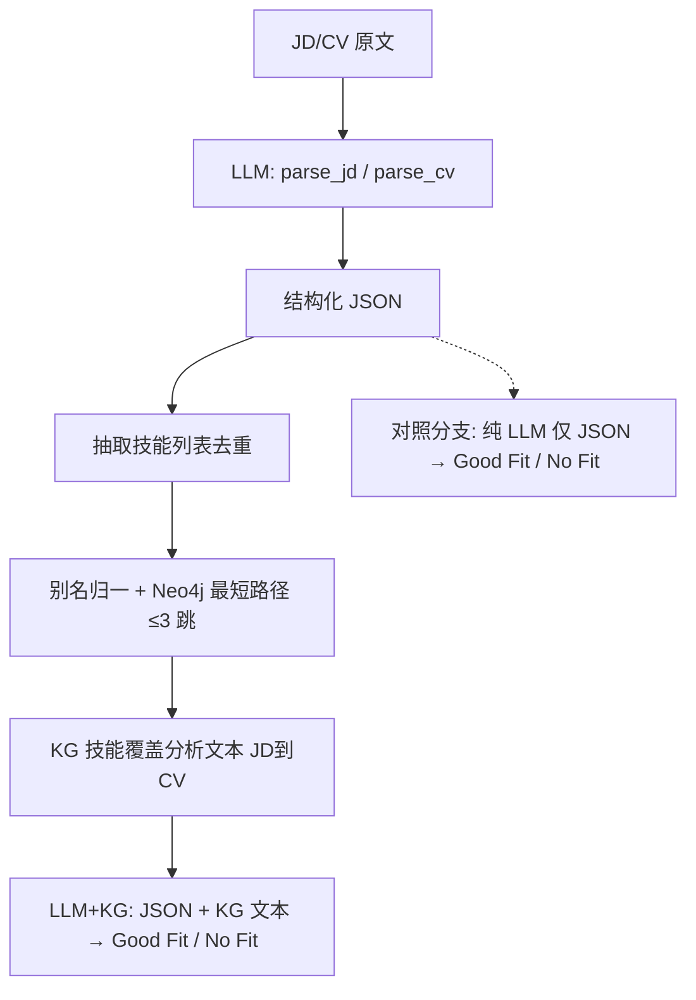

# 面向招聘场景的智能人才评估与推荐平台 — PPT 素材母版

> **用途**：本文档供投喂 AI 生成演示文稿。含项目范围、三大智能模块的数据来源与构建方式、测试协议、核心指标表与配图路径。  
> **本次汇报范围**：结构化信息抽取、技术知识图谱与 GraphRAG、简历过度包装检测（SFT+DPO）、微调模型 HTTP 服务与联调验证。**不包含**基于 OpenClaw 的多智能体跨平台代码评测（可作为后续工作一句带过）。

---

## 元信息

| 项目 | 说明 |
|------|------|
| 项目名称 | ScoutAgent / 面向招聘场景的智能人才评估与推荐平台（人工智能应用实践智能方法技术报告） |
| 核心目标 | 人才真实性验证与能力评估：非结构化文本结构化、技能语义匹配、简历语义夸大识别 |
| 实验原则（复现） | 数据划分固定、评测口径一致、对照方法输入等价；人工标注任务有统一规则与抽样复核 |

---

## 一、智能技术概览（总览页）

### 要解决的业务问题

企业招聘中非结构化简历与岗位描述噪声大，需将「抽取—推理—风险识别」串联为可解释、可落地的智能链路。

### 三大落地模块 + 部署（汇报口径）

1. **简历与岗位结构化信息抽取**：PDF/文本 → 标准 JSON 画像（技能、教育、经历等）。  
2. **技术栈知识图谱与 GraphRAG**：后端领域细粒度图谱 + 多跳加权推理，支撑技能补全与 JD/CV 匹配判别增强。  
3. **简历过度包装检测**：小模型上 **SFT → DPO** 两阶段对齐，输出带推理链的可复核分析。  
4. **模型服务**：微调权重部署于 **AutoDL**，**FastAPI** 对外提供 HTTP 接口，与业务端联调。

### 建议幻灯片：总览

- **建议页标题**：招聘场景智能评估平台 — 技术总览  
- **要点**：  
  - 目标：真实性验证 + 能力评估，多层次可解释输出  
  - 模块：抽取 → 图谱推理 → 夸大检测 → API 服务  
  - 实验：划分与口径统一，便于模块间对照  
- **配图**：可选封面校徽 `media/dhu.png`（机构页）

---

## 二、简历与岗位要求的结构化信息抽取

### 要解决的业务问题

岗位描述与简历多为非结构化文本，直接匹配噪声大；需先抽取关键实体与关系为结构化数据，降低后续模块复杂度。

### 方法要点

- **解析**：PDF 使用 `pdfplumber` 转纯文本。  
- **大模型抽取**：采用 **通义千问（Qwen）API** + **思维链（Chain of Thought）**「由粗到细」两阶段：**语义分块**（简历六类区块 / JD 教育·技能·经历要求等）→ **按 Schema 输出 JSON**。  
- **对照意义**：相对 Naive LLM 零样本直接抽取，验证 **CoT 任务分解** 是否缓解长文本「中间信息丢失」。

### 数据来源

- **简历评测**：Kaggle 公开 **Resume NER Training Dataset**（标准化简历样本）。  
- **岗位抽取评测**：约 **100 条** 真实招聘平台非结构化文本 + 人工提取特征。

### 构建 / 预处理

- 简历侧：与系统分块架构对齐，从 NER 的 14 类标签中选取核心映射：  
  - `DESIGNATION` → 期望职位；`EDUCATION` → 教育；`SKILL` → 专业技能；`EXPERIENCE` + `COMPANY` → 实习/工作经历。  
- 输出为 **JSON**（候选人画像、岗位画像字段）。

### 测试集与协议

- **简历评测集**：数据集中 **5,960** 个样本。  
- **验证逻辑**：系统输出为 JSON 聚合字段，与序列标注位对齐困难，采用「语义关联比对」：抽取内容与原文标注位置文本相似且信息一致则计为有效召回，各核心维度加权平均。  
- **指标**：Precision、Recall、**F1**。

### 核心结果（与报告表一致）

**结构化信息抽取性能对比（简历侧大规模对照）**

| 模型方案 | Precision (%) | Recall (%) | F1 Score (%) |
|----------|-----------------|------------|----------------|
| Naive LLM 直接抽取 (Zero-shot) | 68 | 64 | 66 |
| **Qwen API + CoT 任务分解（本系统）** | **79** | **76** | **78** |

> **口径说明**：报告表格原文写为「Kimi2.5 API」；实现描述为 **通义千问（Qwen）API**。本母版统一为 **Qwen API + CoT 任务分解**，数值与报告一致。

### 建议幻灯片：信息抽取

- **建议页标题**：结构化信息抽取 — CoT 分块与 JSON Schema  
- **要点**：  
  - 输入：PDF/岗位文本；输出：标准 JSON 画像  
  - 两阶段：分块定位 → 局部 Schema 抽取  
  - 基线：Zero-shot 直接抽取；改进：CoT 分解  
  - 简历评测 5,960 条；F1 由 66% → 78%  
- **配图/表**：上表（抽取性能）；可选流程文字页，无单独流程图文件

- **建议页标题（可选）**：岗位与简历评测数据  
- **要点**：Kaggle Resume NER；JD 约 100 条人工对照；语义对齐验证协议  

---

## 三、技术栈知识图谱构建与 GraphRAG 匹配推理

### 要解决的业务问题

关键词字面不一致但技术语义相近时，纯字符串匹配失效；需 **图结构** 表达依赖、归属、共现，支持多跳推理与可解释路径。

### 方法要点

- **存储**：**Neo4j** 属性图；节点以技术 Tag 为主。  
- **关系类型与权重**（与实现 `leave_one_out.py` 中 `_REL_WEIGHT`、`_HOP_DECAY` 一致）：  
  - 一跳衰减 \(\delta(1)=1.0\)，二跳 0.5，三跳 0.25。  
- **技能补全式评分**：对 JD 关键词集合做 **Leave-One-Out**，用其余词作上下文，检验目标技能是否进入 Top-\(K\) 推荐列表（多跳加权 \(\text{score}_{\mathrm{KG}}\)）。  
- **匹配判别增强**：完整 JD/CV 文本经 **DeepSeek Chat** 解析为 JSON → 抽取技能 →（可选）Neo4j **最短路径 ≤3 跳** 生成「KG 技能覆盖分析」文本 → 再调用 LLM 输出 `Good Fit` / `No Fit`，对比 **纯 LLM** 与 **LLM+KG**。

### 数据来源与图谱构建

| 关系 / 内容 | 来源与构造要点 |
|-------------|----------------|
| 标签规范与同义映射 | Stack Overflow **Tag Synonyms**（SEDE 导出 CSV 等），异名归一到规范 Tag |
| `BELONGS_TO` 层次 | GitHub **Awesome** 系列清单（Python / Go / Java 等），章节为大类、条目为细分技能 |
| `DEPENDS_ON` | Maven、PyPI 等制品元数据中的依赖声明 |
| `RELATED_TO` | 热门仓库 **Topics/Tags** 共现统计，阈值抑制噪声 |
| 补充 | GitHub API 爬取 Top 约 **5000** 仓库标签，用于共现与覆盖分析 |

**全图规模（约）**：核心实体 **4,800** 个，三元组 **32,000** 条（增量导入可能略有浮动）。

### 关系类型与权重（与报告表一致）

| 关系名称 | 关系类别 | \(w(r)\) | 业务语义（摘要） |
|----------|----------|----------|------------------|
| BELONGS_TO | 技术归属/分类 | 5.0 | 大类—细分，用于多跳扩展 |
| DEPENDS_ON | 技术依赖 | 3.0 | 强约束依赖链，一跳优先 |
| RELATED_TO | 共现关联 | 1.0 | 弱关联，权重最低 |

### 匹配 / 评测用表格式数据

- **来源**：[Hugging Face `facehuggerapoorv/resume-jd-match`](https://huggingface.co/datasets/facehuggerapoorv/resume-jd-match)（约 8k 行，含 train/test）。  
- **清洗后**：约 **六千余条** 有效记录 → 工程表如 `backend_resume_jd.csv`。  
- **关键构造**：`cv_keywords`、`jd_keywords` **非** HF 原始字段，而是在**固定提示词**下用大模型从全文抽取后写入，作为图谱与留一评估的**统一输入接口**。  
- **字段语义**：`cv`, `jd`, `label`（No Fit / Good Fit / Potential Fit）, `cv_keywords`, `jd_keywords`。

### 测试协议

- **实验一（留一技能补全）**：在 `jd_keywords` 上做 **Leave-One-Out**；基线为 **共现矩阵**、**全局词频**（均来自同源 Neo4j 统计）。指标：**Hit@5、Hit@10、MRR**。  
- **实验二（二分类准确率）**：`valuable_information.py` accuracy 模式；完整文本解析推理；样本 **排除 Potential Fit**，仅 Good Fit / No Fit。对比 **纯 LLM** vs **LLM+KG**。

### 核心结果

**留一技能推荐**

| 方法 | Hit@5 (%) | Hit@10 (%) | MRR (%) |
|------|-----------|------------|---------|
| 知识图谱多跳推荐 (`leave_one_out.py`) | 23.32 | 34.69 | 15.99 |
| 共现矩阵 (`loo_baseline.py`, cooccurrence) | 22.46 | 35.59 | 14.07 |
| 全局词频基线 (`freq`) | 19.61 | 32.06 | 11.99 |

**JD/CV 匹配二分类（剔除 Potential Fit）**

| 方法 | 准确率 (%) |
|------|------------|
| 纯 LLM（结构化 JSON → 预测，无 KG） | 74.3 |
| LLM + KG（JSON + KG 技能覆盖分析 → 预测） | 85.2 |

相对提升约 **10.9** 个百分点。

### 流程图（解析 → 图谱 → 判别）

以下为与报告 **图 `fig:kg_llm_pipeline`** 等价的 Mermaid 数据流，便于 AI 重绘幻灯片。**若需位图**，可使用同目录 `media/kg_llm_pipeline.png`（由 Mermaid 导出，与下图一致）。



**配图说明（建议用于「图谱增强匹配流程」页）**：主路径自上而下为解析、抽取、图谱路径、覆盖文本、再推理；右侧对照为仅 JSON 的纯 LLM 分支。


### 建议幻灯片：知识图谱

- **建议页标题**：后端技术知识图谱 — 数据来源与关系设计  
- **要点**：多源对齐；四类关系；约 4.8k 节点 / 3.2w 边；Neo4j  
- **配图/表**：关系类型表；可选 Awesome / SO 图标占位  

- **建议页标题**：GraphRAG 与留一评测协议  
- **要点**：LOO 任务；多跳加权 vs 共现 vs 词频；Hit@K 与 MRR  
- **配图/表**：留一结果表  

- **建议页标题**：LLM 与图谱协同的匹配判别  
- **要点**：同解析 JSON；叠加 KG 覆盖分析；74.3% → 85.2%  
- **配图/表**：二分类表；`media/kg_llm_pipeline.png` 或上方 Mermaid  

---

## 四、过度包装检测模型（SFT + DPO）

### 要解决的业务问题

识别简历中的 **语义夸大**（层级与事实不符），而非「AI 生成检测」或文风分类；输出需 **可复核**（结论、疑点、面试追问）。

### 方法要点

- **基座模型**：**Qwen3.5 4B**（小参数量，兼顾算力与推理效率）。  
- **训练顺序**：**SFT**（学会固定分析范式与输出结构）→ **DPO**（成对偏好对齐，抬高可信分析、压低误判）。  
- **评测**：**Pairwise Accuracy**（主指标）；**二分类 Accuracy / 宏平均 F1**（与 `is_fabricated` 元数据对齐）；基线为同规模 **Qwen API Zero-shot**，无 SFT/DPO。

### 数据来源与划分

- **与图谱评测同源**：[Hugging Face `facehuggerapoorv/resume-jd-match`](https://huggingface.co/datasets/facehuggerapoorv/resume-jd-match) 清洗对齐 → `backend_resume_jd.csv`。  
- **二次合成**：`make_rl_dataset.py` 管道生成 JSONL（`prompt` / `chosen` / `rejected`）；仅保留 **Good Fit** 与 **Potential Fit**，**排除 No Fit**（避免强行拔高捏造）。  
- **划分**：固定随机种子，**训练集 1000 条**，**测试集 200 条**（约 83% / 17%）。

### 合成策略（与实现一致）

| 策略 | 适用标签 | 摘要 |
|------|----------|------|
| `inflate_weak` | Potential Fit | 高级词汇堆砌、职责夸大，故意留资历/技术矛盾 |
| `inflate_strong` | 部分 Good Fit | 指标夸大 5–20 倍、独揽团队成果等 |
| `authentic` | 部分 Good Fit | 真实 CV；chosen 客观、rejected 模拟无理挑刺 |

**DPO 字段含义**

| 字段 | 含义 |
|------|------|
| `prompt` | 含 JD 与（策略处理后的）CV 的研判指令 |
| `chosen` | 应提高概率：正确识别夸大或公正评价真实简历 |
| `rejected` | 应压低概率：误判或挑刺 |

### 测试集与协议

- 测试集 **n = 200**；与训练同分布、held-out。  
- 报告 Pairwise Acc、Accuracy、F1（见下表）。

### 核心结果

**过度包装检测（测试集 n=200）**

| Method | Accuracy (%) | F1 Score (%) | Pairwise Acc (%) |
|--------|----------------|----------------|------------------|
| 直接调用千问 API (Zero-shot) | 70.5 | 67.8 | 73.5 |
| **本项目：SFT + DPO** | **83.0** | **80.5** | **88.5** |

### 可解释性（业务侧一句话）

学习目标本身是 **长文本分段推理** + **成对偏好**；不是拟合单一标签，而是让结论嵌在 **可追溯推理链** 中，疑点可回落到简历原文。

### 建议幻灯片：过度包装

- **建议页标题**：过度包装检测 — SFT 定型 + DPO 对齐  
- **要点**：语义夸大定义；Qwen3.5 4B；1000/200 划分；三种合成策略  
- **配图/表**：上表；DPO 字段表（简）  

- **建议页标题**：可解释输出形态  
- **要点**：逐项核查—数据自洽—结论—面试追问；偏好对抬高可复核分析  

---

## 五、模型服务与接口验证（非多智能体）

### 部署说明

- **权重**：过度包装检测模型基于 Qwen3.5 4B，经 SFT+DPO 得到专用权重。  
- **推理环境**：**AutoDL** 云主机，Ubuntu 22.04，GPU：NVIDIA GeForce RTX 5090。  
- **服务**：**FastAPI** HTTP 接口；网站部署于阿里云，业务侧通过 **SSH** 与 AutoDL 端口映射连通。

### 配图（联调截图）

- **`media/client.png`**：**建议用于「客户端请求与响应」页** — 展示向检测服务发起请求与返回体。  
- **`media/server.png`**：**建议用于「服务端 FastAPI」页** — 展示 AutoDL 上服务日志与接口行为。


### 建议幻灯片：部署

- **建议页标题**：微调模型部署与联调  
- **要点**：AutoDL + FastAPI；SSH/端口映射；与评测任务一致的请求验证  
- **配图**：`client.png`、`server.png`  

---

## 六、结论与核心数字（收尾页）

- **信息抽取**：Qwen + CoT 相对 Zero-shot 直接抽取，F1 **66% → 78%**（简历 5,960 条对照）。  
- **知识图谱**：留一任务上图谱多跳在 **Hit@5** 与 **MRR** 上优于共现与词频；JD/CV 二分类 **LLM+KG 85.2%** vs 纯 LLM **74.3%**。  
- **过度包装**：SFT+DPO 相对 Zero-shot，**Pairwise Acc 73.5% → 88.5%**，F1 **67.8% → 80.5%**（n=200）。  

**后续工作（可选口头一句）**：多智能体代码评测、跨领域泛化、人机协同面试联动等可继续扩展；本次汇报不包含 OpenClaw 跨平台检测方案。

---

## 附录：投喂 AI 生成 PPT 时的提示词片段（可复制）

```
请根据 ppt_source_zh.md 生成中文演示文稿：
- 约 12–16 页；每页有标题与 3–5 条要点；
- 数字与表格严格采用文档中的表；
- 使用文档中的图片路径插入：media/dhu.png, media/kg_llm_pipeline.png, media/client.png, media/server.png；
- 不要包含多智能体/OpenClaw/代码注入评测数据集等内容。
```

---

## 自检清单

- [x] 数字与 [report.tex](report.tex) 中主表一致。  
- [x] 未写入 OpenClaw、多智能体评测、100 个 GitHub 注入缺陷等排除内容。  
- [x] 每张图有用途说明；每模块有建议页标题与要点。  
- [x] 信息抽取 API 口径统一为 **Qwen API + CoT**（与实现描述一致）。
